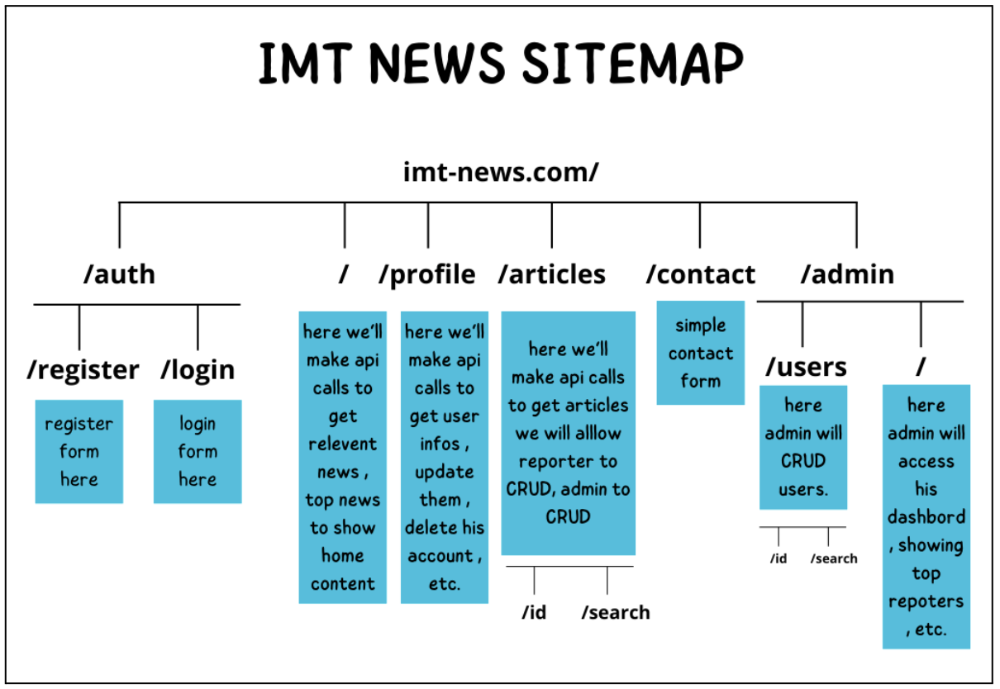
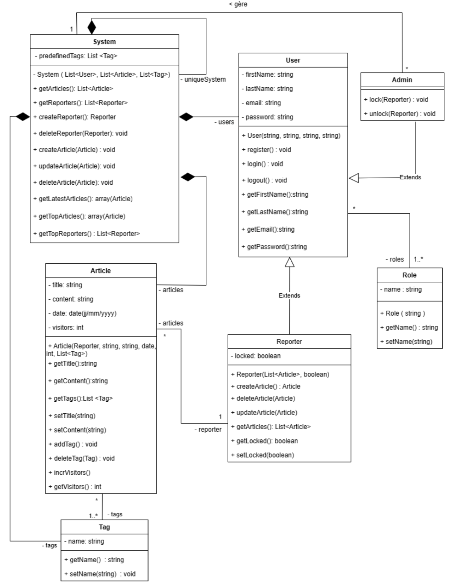
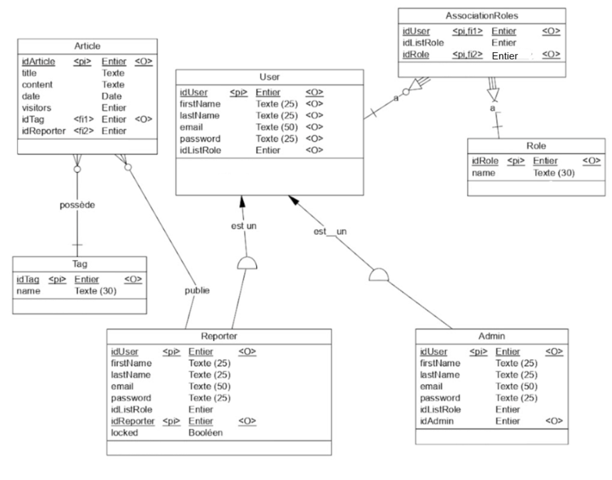

# Projet d'application web "IMT News"

## Description
Ce projet est réalisé dans le cadre d'un projet étudiant en développement web. L'objectif est de créer un site web d'actualités en ligne conformément aux spécifications du cahier des charges.

## Technologies
- Symfony - Version : 6.1.12
- PHP - Version : 8.3.3
- PHPMyAdmin
- MySQL

## Installation
1. Pour installer Symfony et PHP, veuillez suivre ce [tutoriel](https://symfony.com/doc/current/setup.html).
2. Cloner le projet depuis GitLab en utilisant ce [guide](https://docs.github.com/fr/repositories/creating-and-managing-repositories/cloning-a-repository).
3. Exécuter les commandes suivantes : 
  * `composer require symfony/asset-mapper` - Version 6.3
  * `composer install` - Version 2.7.1
  * `composer require symfony/runtime` - Version 6.1.*
  

## Déploiement
Naviguez vers le répertoire racine du projet /imtnews et lancez le serveur en utilisant la commande : `symfony server:start`. Le site sera accessible en local à l'adresse suivante : [http://127.0.0.1:8000](http://127.0.0.1:8000).

## Consignes
Le projet doit respecter les consignes suivantes :

- Le projet doit être réalisé en groupes de 6 personnes, avec des sous-groupes de 2 personnes chacun.
- Respecter les noms de groupes suggérés.
- Créer un site web d'actualités en ligne avec les fonctionnalités suivantes :
  - Ajout de nouvelles
  - Lecture des nouvelles
  - Administration du site
- Respecter la charte graphique de l'IMT Atlantique pour le style du site.
- Assurer la sécurité du site en n'autorisant l'accès qu'aux utilisateurs enregistrés, en protégeant contre les injections SQL et les attaques XSS.

## Conception
### Maquette du Site Web : Conception Visuelle et Navigation
Maquette du site web disponible sur ce lien : [Cacoo](https://cacoo.com/diagrams/W4ZMH7CAfjKM6KML/C3E6F?fbclid=IwAR0GFvOVYckM6ORRkp0dyXVo2q6R-Pim2Dmbhq9Hw2-O5vHmOOb4yfp-eRc)
### Élaboration de l'Arborescence : Structuration et Organisation du Site

### Diagramme de Classes UML

Le diagramme de classes ci-dessus représente 7 classes: 

- La classe System qui va gérer l’ensemble des constituants : les articles, les utilisateurs et les tags. Elle a comme attributs la liste des tags prédéfinis, la liste des articles et la liste des utilisateurs dont le système est “composé”. Ses méthodes permettent de réaliser la manipulation de tous les éléments à savoir : 
  * L’accès aux articles et aux reporters à travers les getters
  * La création et la suppression d’un article ou d’un reporter (createReporter, createArticle, deleteReporter, deleteArticle )
  * La mise à jour d’un article ( updateArticle )
  * La récupération des articles récents, des meilleurs articles et des meilleurs reporters

- Le choix de créer une classe système singleton avec un constructeur privé assure qu'une seule instance de la classe est créée et qu'elle reste la seule instance accessible dans tout le logiciel. En déclarant le constructeur comme privé, on empêche les utilisateurs de créer de nouvelles instances, garantissant ainsi qu'un seul objet peut être utilisé dans l'application. Cela renforce la cohérence des données et simplifie la gestion des ressources.

- La classe User qui identifie un utilisateur par son nom, son prénom, son email et son mot de passe. Le User a aussi une liste de rôles qui permet de spécifier son rôle dans la plateforme ( reporter, admin ou les deux à la fois). Nous avons opté pour le choix d’une liste de rôles pour adapter notre conception à d’éventuels rôles qui peuvent s’ajouter. Cette classe permet alors à l’utilisateur de créer un compte “register( )”, de se connecter  “login( )” et de se déconnecter “logout( )”. Elle récupère ses informations à travers des getters. Dans cette version simpliste nous avons choisi de ne pas gérer les modifications du profil de l’utilisateur. 

- La classe Reporter qui hérite de la classe User. Elle hérite tout ce qui est relatif au User avec en plus l’attribut “articles” représentant la liste des articles que possède le reporter et un attribut “locked” indiquant l’état de celui-ci.  Cette classe permet au reporter à travers les méthodes associés de créer/modifier/supprimer un article. Elle possède de plus un getter et un setter de l’attribut locked qui sera utile pour l’admin avec en plus le getter de la liste des articles.

- La classe Admin qui hérite aussi de la classe User et gère le système à travers sa relation avec la classe System. L’admin peut soit activer ou désactiver un reporter ( unlock / lock ).

- La classe Role qui identifie un rôle spécifique de l’utilisateur repérable par son nom.  Le choix d’ajouter une classe Role donne la possibilité d’ajouter éventuellement d’autres rôles autres que Admin et Reporter. Elle possède un getter et un setter pour le nom. 

- La classe Article permet de représenter l’article de presse par son titre, un contenu, sa date de publication et le nombre de vues avec en plus son auteur qui dans notre cas un Reporter. Nous avons ajouté des getters des ces attributs avec des setters pour le titre et du contenu qui sont utiles lors de la modification de l’article ainsi que les méthodes pour l’ajout/suppression de tag. La méthode incrVisitors( ) met à jour le nombre de vues quand un visiteur consulte l’article

- La classe Tag qui représente la catégorie de l’article. Elle s’identifie par son nom consultable et modifiable à travers son getter et son setter. Puisqu'il y a des tags prédéfinis par l'administrateur, nous avons choisi de les mettre dans une liste predefinedTags qui n'est modifiable que par l'administrateur. La liste tags dans le système contient tous les tags, y compris ceux qui sont définis par l'administrateur.

### Schéma logique
Dans le schéma logique, chaque classe, à l'exception de la classe système, est convertie en une table en tenant compte des cardinalités présentées dans le diagramme de classes, qu'il s'agisse de one-to-many, many-to-one ou many-to-many. Dans le cas d'une association many-to-many, comme entre les classes User et Role, une table intermédiaire appelée "AssociationRole" est ajoutée pour gérer cette relation. Le schéma de la base de données est généré par le logiciel dédié PowerAMC, prenant en compte les clés primaires, les clés étrangères, les types d'associations et l'héritage.

## Auteurs
- AAGOUR Fouad
- BELARBI Molka
- BEN JEMAA Yosr
- DIROU Aïna
- HAMDI Messaoud
- MARZOUGUI Mariem

Groupe 4 : IMT News - IMT Atlantique - 2024